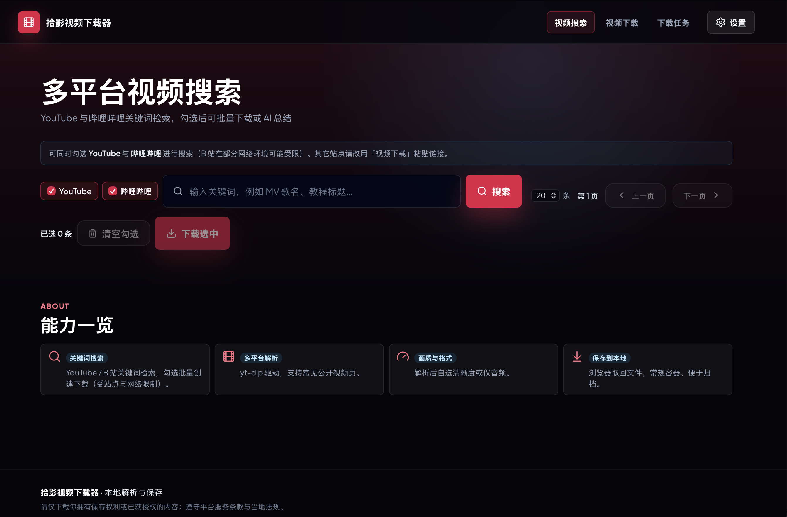
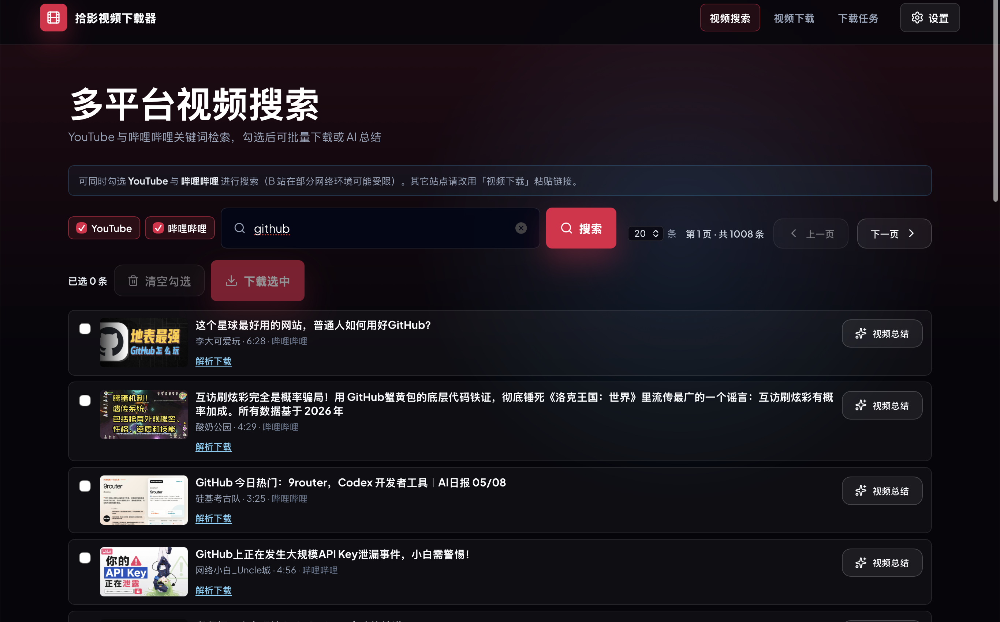
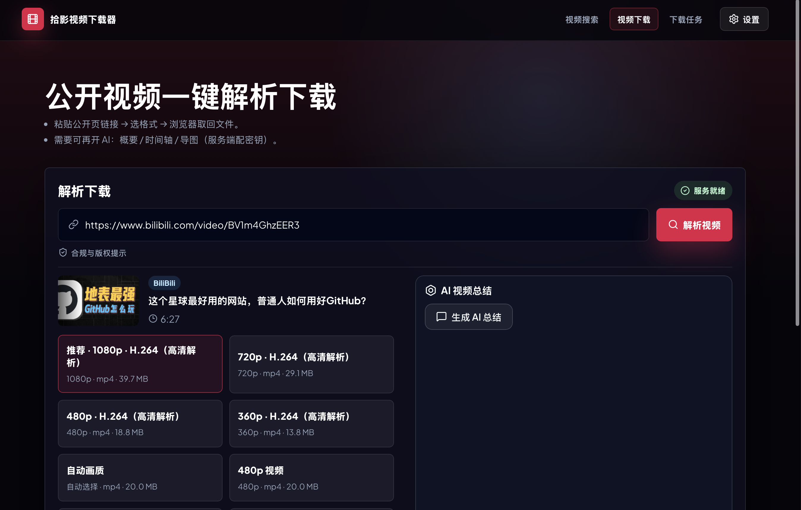
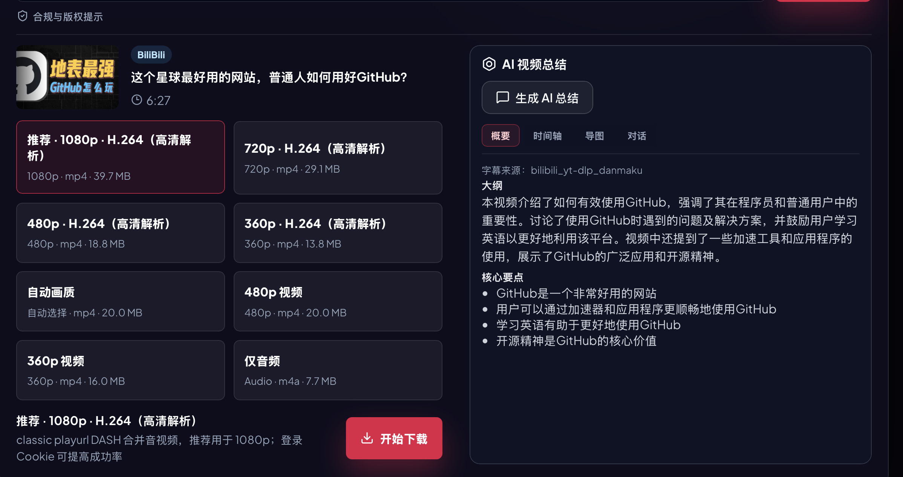
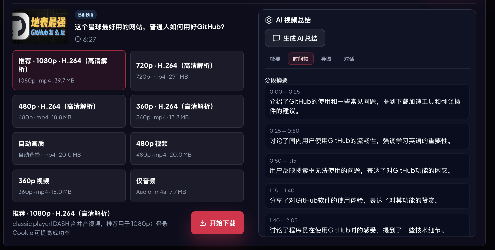
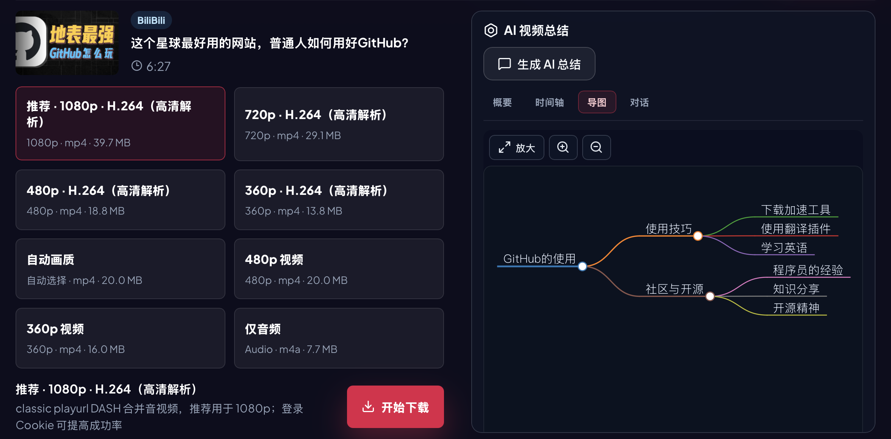
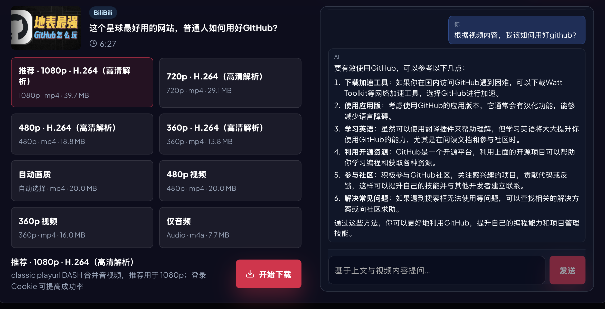

# 拾影

> 一站式视频下载平台.

自己搭建的视频下载平台，集视频搜索、下载、AI总结与视频对话等功能。

## 功能介绍

- **一站式视频搜索和下载**: 支持搜索公开视频并直接选择下载，减少“先找再粘贴”的操作成本。
- **批量下载**: 支持视频批量下载。
- **AI视频总结**: 基于字幕生成大纲、分段摘要、时间轴和思维导图。
- **AI视频对话**: 基于AI实现围绕视频内容进行问答。
  
## Demo

### 视频搜索：





### 视频下载：



### AI 总结：







### AI 视频对话：



## 结构图

```text
Vue Frontend
    |
    v
FastAPI Backend
    |
    +--> video search
    +--> yt-dlp / platform-specific parsers
    +--> download tasks
    +--> subtitle extraction
    +--> AI summary and video chat
```

## 技术栈

- **前端**: Vue 3, TypeScript
- **后端**: FastAPI, Uvicorn, yt-dlp, curl-cffi

## 快速开始

```bash
git clone https://github.com/m4rklee/video-grab.git
cd video-grab
```

启动后端:

```bash
cd backend
python -m venv .venv
source .venv/bin/activate
pip install -r requirements.txt
cp .env.example .env
uvicorn app.main:app --host 0.0.0.0 --port 9279
```

启动前端:

```bash
cd frontend
npm install
npm run dev
```

前端默认端口由 `frontend/package.json` 控制：

```text
http://127.0.0.1:9280
```

## 用法

1. 在搜索页输入关键词，选择需要下载的视频。
2. 或在下载页粘贴公开视频链接。
3. 选择格式和清晰度后创建下载任务。
4. 若配置了 AI API，可对视频字幕生成总结、时间轴、思维导图并进行问答。

更多配置见：

```text
docs/CONFIGURATION.md
docs/FRONTEND.md
docs/VIDEO_DOWNLOAD_SUMMARY.md
```

## 项目结构

```text
backend/                 # 后端代码
frontend/                # 基于 Vue 3 的前端页面
docs/                    # 文档
```

## 限制

- 请只下载你有权访问和保存的公开视频内容。
- 不同平台的解析能力会随站点策略变化而变化。
- AI 总结依赖字幕质量和模型配置，结果需要人工核对。
- 大文件下载建议在本地或私有服务器中运行，注意磁盘空间。
